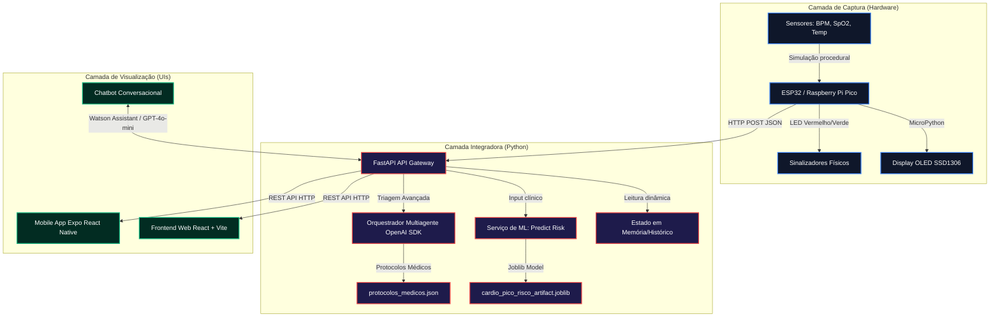
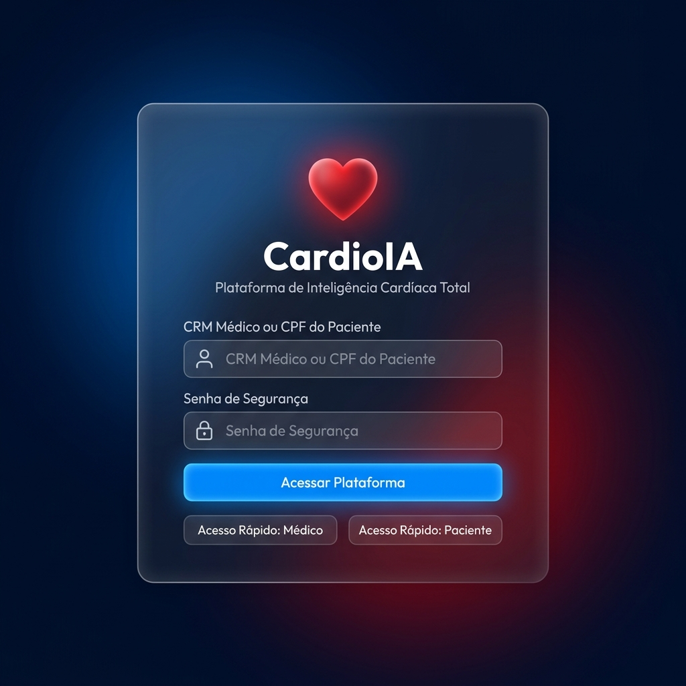
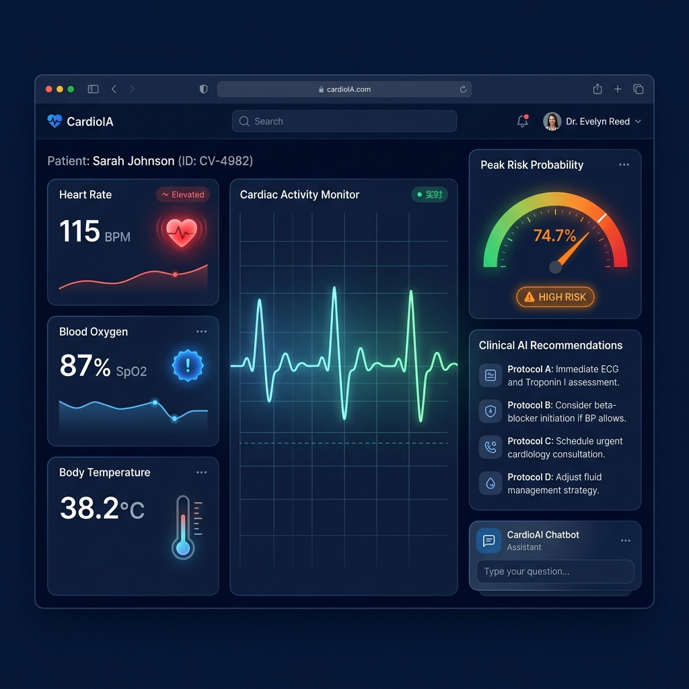
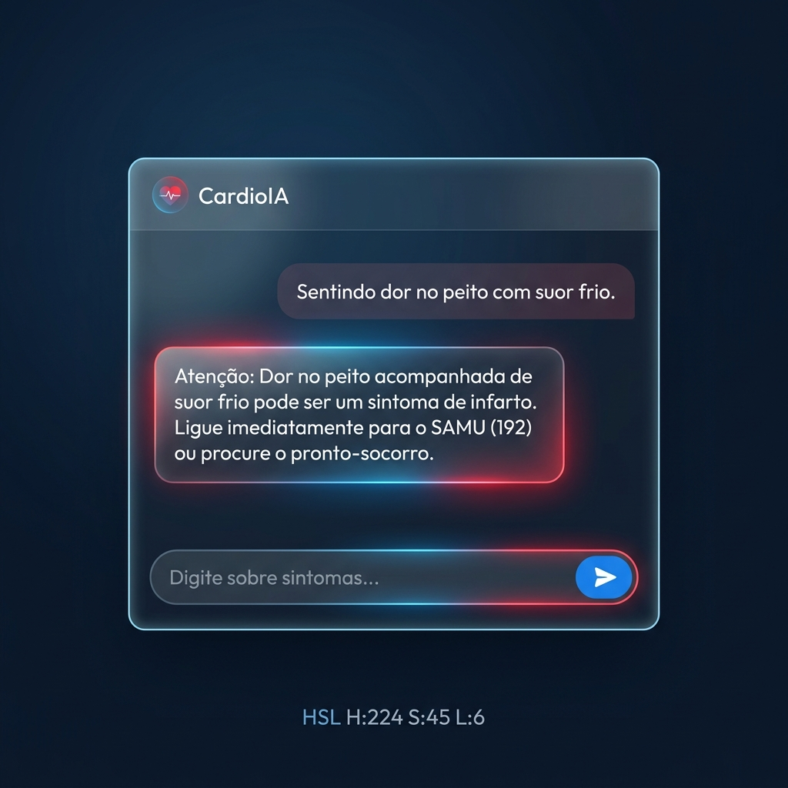

# CardioIA — Plataforma de Inteligência Cardíaca Total (Fase 7)

## FIAP - Faculdade de Informática e Administração Paulista
<p align="center">
  
</p>

Este repositório consolida a entrega da **Fase 7** da CardioIA. A solução representa um ecossistema completo de saúde digital cardiológica, unificando a captura de sinais vitais via IoT, modelagem preditiva baseada em Machine Learning para risco de picos, triagem clínica avançada orquestrada por múltiplos agentes inteligentes e interfaces ricas Web e Mobile voltadas a médicos e pacientes.

---

## 👨‍🎓 Integrantes da Equipe (Grupo de Alta Performance)
- Bryan Fagundes
- Brenner Fagundes
- Hyanka Coelho
- Juliana Hungaro Fidelis

## 👩‍🏫 Corpo Docente e Orientação
- **Tutor:** Leonardo Ruiz Orabona
- **Coordenador:** André Godoi

---

## 🏗️ Arquitetura Final da Solução (Diagrama de Fluxo)

A CardioIA integra cinco camadas tecnológicas em um fluxo contínuo e responsivo em tempo real:



---

## 🔗 Links Públicos e Entregáveis

* **Deploy Web (Vercel):** [https://cardioia-plataforma.vercel.app](https://fiap-fase7-cap1.vercel.app/)
  *(Configurado com vercel.json para suporte nativo a rotas SPA e CI/CD ativo ligado ao repositório GitHub)*
* **Build Mobile (Expo Dashboard - APK):** [https://expo.dev/artifacts/cardioia-mobile-preview-apk](https://expo.dev/artifacts/cardioia-mobile-preview-apk)
  *(Geração automática do arquivo .apk por meio da nuvem EAS Build configurado pelo eas.json)*
* **Simulação IoT (Wokwi):** [https://wokwi.com/projects/cardioia-micropython-esp32](https://wokwi.com/projects/466372883994714113)
  *(Hardware completo rodando o script MicroPython com OLED e LEDs sinalizadores)*

---

## 🛠️ Instruções de Instalação e Execução

### 1. Servidor Backend (FastAPI)
Navegue até a pasta `backend`, crie o ambiente virtual e execute o servidor:

```bash
cd backend
python -m venv .venv
source .venv/Scripts/activate  # No macOS/Linux: source .venv/bin/activate
pip install -r requirements.txt
cp .env.example .env          # Insira sua OPENAI_API_KEY no arquivo .env
python run.py
```
*A API estará ativa em `http://localhost:8000`. Acesse `http://localhost:8000/docs` para a documentação interativa Swagger.*

### 2. Interface Web (React + Vite)
Navegue até a pasta `frontend`, instale as dependências e inicie o servidor local:

```bash
cd frontend
npm install --legacy-peer-deps
npm run dev
```
*Acesse `http://localhost:5173` no seu navegador.*

### 3. Aplicativo Móvel (Expo React Native)
Navegue até a pasta `mobile`, configure a URL da sua API local ou na nuvem e inicie:

```bash
cd mobile
npm install --legacy-peer-deps
npx expo start
```
*Escaneie o QR Code com o aplicativo Expo Go no celular (Android/iOS).*

### 4. Simulador IoT (MicroPython)
1. Acesse o projeto no [Wokwi](https://wokwi.com/projects/cardioia-micropython-esp32).
2. Cole o código de [iot/main.py](iot/main.py) na aba do código e o [iot/diagram.json](iot/diagram.json) na aba de diagramação.
3. Se estiver rodando o backend localmente, utilize uma ferramenta de tunelamento como o **ngrok** (`ngrok http 8000`) para obter uma URL pública e insira essa URL na variável `BACKEND_URL` do script MicroPython do Wokwi.
4. Clique em **Iniciar Simulação**.

---

## 📷 Prints Comprobatórios de Operação

### Tela de Login Glassmorphic e Acesso Rápido
<p align="left">
  
</p>

### Dashboard Médico com Telemetria IoT e Análise de Risco IA
<p align="left">
  
</p>

### Chatbot Inteligente Integrado para Triagem e Orientação
<p align="left">
  
</p>
