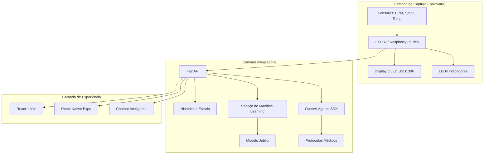

# CardioIA

## FIAP - Faculdade de Informática e Administração Paulista

<p align="center">
<a href= "https://www.fiap.com.br/"></a>
</p>
<br>

# Plataforma de Inteligência Cardíaca Total

Projeto acadêmico focado no desenvolvimento de uma plataforma integrada de saúde digital cardiológica. A solução combina Internet das Coisas (IoT), Inteligência Artificial, Machine Learning, Arquitetura Multiagente e aplicações Web e Mobile para monitoramento, triagem e análise preditiva de risco cardíaco em tempo real.

## 👨‍🎓 Integrantes:

- <a href="https://www.linkedin.com/in/bryanjfagundes/">Bryan Fagundes</a>
- <a href="https://br.linkedin.com/in/brenner-fagundes">Brenner Fagundes</a>
- <a href="https://www.linkedin.com/in/hyankacoelho/">Hyanka Coelho</a>
- <a href="https://www.linkedin.com/in/julianahungaro/">Juliana Hungaro Fidelis</a>

## 👩‍🏫 Professores:

### Tutor(a)

- <a href="https://www.linkedin.com/in/leonardoorabona?utm_source=share&utm_campaign=share_via&utm_content=profile&utm_medium=android_app">Leonardo Ruiz Orabona</a>

### Coordenador(a)

- <a href="https://www.linkedin.com/in/andregodoichiovato/">André Godoi</a>

## 📜 Descrição

Este repositório consolida a entrega da Fase 7 do projeto CardioIA.

A solução representa um ecossistema completo de saúde digital cardiológica, integrando dispositivos IoT para captura de sinais vitais, modelos de Machine Learning para predição de risco cardíaco, agentes inteligentes para triagem clínica automatizada e interfaces Web e Mobile voltadas para médicos e pacientes.

O objetivo é proporcionar monitoramento contínuo, suporte à tomada de decisão clínica e atendimento inteligente baseado em IA.

### Principais Funcionalidades

- Captura de sinais vitais via IoT.
- Predição de risco cardíaco utilizando Machine Learning.
- Triagem automatizada com arquitetura multiagente.
- Dashboard médico para monitoramento em tempo real.
- Aplicativo móvel para acompanhamento dos pacientes.
- Chatbot inteligente para suporte e orientação.

## 👀 Visão Geral

O fluxo completo da solução ocorre da seguinte forma:

1. Sensores IoT coletam sinais vitais do paciente.
2. Os dados são enviados para a API central via HTTP.
3. O modelo de Machine Learning calcula o nível de risco cardíaco.
4. Agentes inteligentes realizam a triagem clínica.
5. As informações são disponibilizadas para Web, Mobile e Chatbot.
6. Profissionais de saúde recebem suporte para tomada de decisão.

## 🏗️ Arquitetura da Solução

### Arquitetura Final da Plataforma



## 📁 Estrutura de Pastas

```text
cardioia/
├── backend/     
├── docs/         
├── frontend/     
├── iot/          
├── mobile/       
├── .gitignore
└── README.md
```

## 📂 Organização do Código

### Backend
Responsável pela API FastAPI, integração com IA, Machine Learning e orquestração dos agentes.

### Frontend Web
Interface médica desenvolvida em React e Vite.

### Mobile
Aplicação React Native utilizando Expo.

### IoT
Scripts MicroPython para ESP32 e Raspberry Pi Pico.

### Machine Learning
Modelos preditivos exportados em formato Joblib.

## 📝 Pré-requisitos

- Python 3.11+
- Node.js 20+
- NPM
- Expo CLI
- OpenAI API Key
- Conta Wokwi (opcional)
- Git

## 🤖 Instalação e Execução

### 1. Servidor Backend (FastAPI)

Navegue até a pasta `backend`, crie o ambiente virtual e execute o servidor:

```bash
cd backend

python -m venv .venv

source .venv/Scripts/activate
# No macOS/Linux:
# source .venv/bin/activate

pip install -r requirements.txt

cp .env.example .env
# Insira sua OPENAI_API_KEY no arquivo .env

python run.py
```

A API estará ativa em:

```text
http://localhost:8000
```

Documentação interativa Swagger:

```text
http://localhost:8000/docs
```

### 2. Interface Web (React + Vite)

Navegue até a pasta `frontend`, instale as dependências e inicie o servidor local:

```bash
cd frontend

npm install --legacy-peer-deps

npm run dev
```

Acesse:

```text
http://localhost:5173
```

### 3. Aplicativo Móvel (Expo React Native)

Navegue até a pasta `mobile`, configure a URL da sua API local ou na nuvem e inicie a aplicação:

```bash
cd mobile

npm install --legacy-peer-deps

npx expo start
```

Escaneie o QR Code utilizando o aplicativo **Expo Go** no celular (Android/iOS).

### 4. Simulador IoT (MicroPython)

1. Acesse o projeto no Wokwi.
2. Cole o código de `iot/main.py` na aba de código.
3. Cole o conteúdo de `iot/diagram.json` na aba de diagramação.
4. Caso o backend esteja sendo executado localmente, utilize uma ferramenta de tunelamento para obter uma URL pública:

```bash
ngrok http 8000
```

5. Insira a URL gerada pelo ngrok na variável:

```python
BACKEND_URL
```

presente no script MicroPython do Wokwi.

6. Clique em **Iniciar Simulação**.

### Fluxo de Execução da Solução

Para executar a plataforma completa, recomenda-se seguir a seguinte ordem:

1. Iniciar o Backend (FastAPI).
2. Iniciar a Interface Web.
3. Iniciar o Aplicativo Mobile.
4. Executar a Simulação IoT no Wokwi.

Com todos os componentes em execução, os sinais vitais capturados pelos dispositivos IoT serão enviados para a API, processados pelos modelos de Machine Learning e disponibilizados em tempo real para as aplicações Web, Mobile e Chatbot.
## 🔗 Links Públicos e Entregáveis

### Aplicação Web
https://fiap-fase7-cap1.vercel.app/

Configurado com vercel.json para suporte nativo a rotas SPA e CI/CD ativo ligado ao repositório GitHub

### Aplicativo Mobile
https://expo.dev/accounts/juhungaro/projects/cardioia-mobile/builds/b06528e1-80eb-4abf-b480-ba15ea02b567

Geração automática do arquivo .apk por meio da nuvem EAS Build configurado pelo eas.json

### Simulação IoT
https://wokwi.com/projects/466372883994714113

Hardware completo rodando o script MicroPython com OLED e LEDs sinalizadores

## 📷 Evidências da Solução

### Tela de Login


### Dashboard Médico


### Chatbot Inteligente


## 🚀 Tecnologias Utilizadas

### Backend

- Python
- FastAPI
- OpenAI Agents SDK
- Pydantic
- Scikit-learn
- Joblib

### Frontend

- React
- Vite
- TypeScript

### Mobile

- React Native
- Expo

### IoT

- ESP32
- Raspberry Pi Pico
- MicroPython
- OLED SSD1306

### Infraestrutura

- Vercel
- Expo EAS Build
- Wokwi

## ✍️ Documentação

- Arquitetura da Solução
- Modelo de Machine Learning
- Evidências da Plataforma
- Simulação IoT
- Integração Multiagente

## 📋 Critérios da Atividade

| Critério | Evidência de Atendimento |
|-----------|-------------|
| **IoT Integrada** | Sensores simulados em ambiente Wokwi enviando dados em tempo real para a API da plataforma. |
| **Machine Learning** | Modelo de classificação de risco cardíaco integrado ao fluxo operacional da solução. |
| **Arquitetura Multiagente** | Agentes especializados orquestrados pelo OpenAI Agents SDK para triagem e análise clínica. |
| **Aplicação Web** | Interface Web responsiva para monitoramento e visualização de indicadores clínicos. |
| **Aplicação Mobile** | Aplicativo mobile desenvolvido em React Native com suporte a Android e iOS via Expo. |
| **API FastAPI** | API REST responsável pelo processamento dos dados, integração dos serviços e disponibilização das funcionalidades. |
| **IA Generativa** | Chatbot inteligente para suporte conversacional e orientação contextualizada aos usuários. |
| **Deploy em Nuvem** | Publicação da aplicação Web na Vercel e distribuição do aplicativo através do Expo EAS Build. |

## 🎥 Vídeo da Solução
[https://youtu.be/ZY621jBy58I]

## 📋 Licença
<p xmlns:cc="http://creativecommons.org/ns#" xmlns:dct="http://purl.org/dc/terms/"><a property="dct:title" rel="cc:attributionURL" href="https://github.com/agodoi/template">MODELO GIT FIAP</a> por <a rel="cc:attributionURL dct:creator" property="cc:attributionName" href="https://fiap.com.br">Fiap</a> está licenciado sobre <a href="http://creativecommons.org/licenses/by/4.0/?ref=chooser-v1" target="_blank" rel="license noopener noreferrer" style="display:inline-block;">Attribution 4.0 International</a>.</p>
