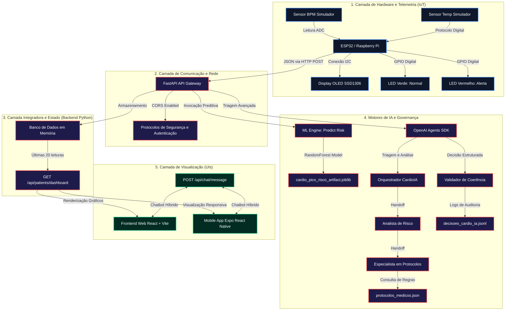

# Relatório Técnico — CardioIA (Fase 7)
## Plataforma de Inteligência Cardíaca Total: Integração IoT, Machine Learning e Multiagentes

---

## 1. Introdução e Contexto do Projeto

O CardioIA representa uma evolução paradigmática no desenvolvimento de plataformas de saúde digital voltadas para a cardiologia. O objetivo principal desta solução é preencher a lacuna entre o monitoramento contínuo de pacientes em leitos hospitalares ou ambientes domésticos e a tomada de decisão médica rápida e baseada em dados. 

Na Fase 7, a CardioIA atinge o status de plataforma integrada, materializando a inteligência analítica em um ecossistema operacional fim a fim. Deixa-se de trabalhar com blocos de processamento isolados para consolidar uma arquitetura de serviços em tempo real, onde dados biométricos transitam continuamente do hardware à interface do usuário, sob a auditoria de um pipeline de governança de inteligência artificial. A solução é composta por:
1. **Dispositivos IoT de Telemetria:** Sensores integrados que medem frequência cardíaca, saturação de oxigênio e temperatura, processados localmente via MicroPython.
2. **Backend Integrador (FastAPI):** Um núcleo em Python que recebe dados, executa pipelines preditivos e orquestra a comunicação conversacional.
3. **Modelos Preditivos de IA:** Um modelo clássico de Machine Learning para a previsão de picos de risco cardíaco associado a um ecossistema cognitivo de múltiplos agentes (OpenAI Agents SDK).
4. **Interfaces de Alta Fidelidade (Web & Mobile):** Dashboards responsivos voltados para médicos e pacientes, integrando gráficos dinâmicos de telemetria e triagem conversacional.

---

## 2. Diagrama de Arquitetura Final e Engenharia de Integração

A arquitetura final do CardioIA adota um modelo descentralizado de microsserviços e processamento reativo, dividido em cinco camadas fundamentais:



### Detalhamento Técnico das Camadas:

* **Camada 1 (Captura e Telemetria):** O microcontrolador ESP32 executa leituras analógicas e digitais periódicas. Os batimentos cardíacos (BPM) e a oxigenação (SpO2) são gerados através de um modelo procedural estocástico para simular variações biológicas realistas. A temperatura corporal simula leituras térmicas. O display OLED local serve como feedback imediato ao profissional de saúde no leito do paciente.
* **Camada 2 (Rede e Gateway):** O ESP32 despacha um payload estruturado em JSON via requisições HTTP POST para a API do backend a cada 5 segundos. O backend FastAPI atua como o ponto de entrada único (API Gateway), gerenciando CORS para permitir conexões de origens web (`https://...vercel.app`) e do aplicativo mobile.
* **Camada 3 (Backend e Estado):** Como o MVP gerencia o estado dinâmico dos sinais vitais em tempo real, as leituras são mantidas em um repositório em memória estruturado no backend. Isso permite a persistência do histórico dos últimos 50 registros do paciente de forma reativa e com latência extremamente baixa.
* **Camada 4 (Inteligência Artificial):**
  * **Machine Learning:** O backend carrega em memória o arquivo `cardio_pico_risco_artifact.joblib` (modelo RandomForestClassifier treinado com dados demográficos e de recursos). A cada telemetria recebida do IoT, a API mescla os sinais dinâmicos com o perfil cadastrado (idade, carga do sistema do hospital, disponibilidade de recursos) e executa o classificador para prever a probabilidade exata de pico de risco.
  * **Orquestrador Multiagente:** A triagem profunda é orquestrada através do OpenAI Agents SDK. Quando o médico aciona a análise, o **Orquestrador CardioIA** inicia a conversa, transfere para o **Analista de Risco** (que invoca a ferramenta do classificador de ML), e este faz handoff para o **Especialista em Protocolos** (que consulta as regras institucionais e emite a decisão estruturada formatada via Pydantic).
* **Camada 5 (Visualização):** O frontend Web (React + Vite) e o aplicativo móvel (React Native + Expo) realizam requisições periódicas curtas (polling de 3s) para a API para renderizar gráficos de linha (usando caminhos SVG suavizados dinamicamente) e velocímetros indicativos de risco.

---

## 3. Firmware MicroPython e Hardware IoT

A migração de C/C++ para MicroPython no ESP32 confere flexibilidade na manipulação de barramentos e de requisições de rede. O script local [main.py](file:///c:/Users/danie/OneDrive/Documentos/Juliana/FIAP/fiap-fase7-cap1-main/iot/main.py) foi construído seguindo os padrões de programação concorrente e tratamento de exceções em sistemas embarcados:

1. **Gestão de Rede:** O módulo `network` configura a interface de estação (`STA_IF`) e se associa ao ponto de acesso virtual `Wokwi-GUEST`. A rotina possui tratamento contra quedas de sinal e reinicia a conexão caso haja desconexão.
2. **Exibição OLED SSD1306:** Através do barramento I2C físico do ESP32 (SDA ligado ao GPIO21, SCL ligado ao GPIO22), o script MicroPython mapeia a tela de 128x64. O buffer de escrita é atualizado ciclicamente a cada leitura para evitar o efeito de *flicker* na tela.
3. **Controle de LEDs Indicadores de Risco (GPIO12 e GPIO14):**
   * Em condições saudáveis (BPM < 100 e SpO2 >= 92%), o GPIO12 (LED Verde) permanece ativo em nível alto (`value(1)`), indicando estabilidade clínica local.
   * Ao detectar arritmias (BPM > 100) ou hipóxia clínica (SpO2 < 92%), o script local corta a tensão no LED verde e executa uma rotina de pulsação de ciclo rápido no GPIO14 (LED Vermelho), servindo como aviso físico no leito hospitalar.
4. **Envio HTTP:** A biblioteca `urequests` envia os pacotes JSON via socket. Em caso de queda do servidor FastAPI, o firmware impede o travamento do loop capturando exceções de conexão e exibindo `ERRO CONEXAO` no display OLED, restabelecendo o envio de forma automática assim que o servidor retorna à operação.

---

## 4. Governança de Inteligência Artificial e Log de Decisões

Para garantir a segurança do paciente e mitigar erros decorrentes de alucinações de modelos de linguagem de grande escala (LLMs), implementamos uma camada de **Governança Preditiva** e validação de coerência.

O validador de coerência de dados atua em nível de código no backend ([agent_orchestrator.py](file:///c:/Users/danie/OneDrive/Documentos/Juliana/FIAP/fiap-fase7-cap1-main/backend/app/agent_orchestrator.py)) e confronta as conclusões dos agentes de IA contra regras médicas rígidas e parametrizações do arquivo [protocolos_medicos.json](file:///c:/Users/danie/OneDrive/Documentos/Juliana/FIAP/fiap-fase7-cap1-main/backend/data/protocolos_medicos.json):

* **Fator de Crise de Saturação:** Se o sensor IoT registrar `SpO2 <= 88%` (hipóxia grave), a governança exige que as recomendações finais da triagem dos agentes contenham explicitamente os termos "oxigênio", "oxigenoterapia" ou "SpO2". Caso contrário, a decisão é classificada como **incoerente**.
* **Alinhamento ML vs Agente:** O modelo de Machine Learning (`cardio_pico_risco_artifact.joblib`) é a verdade matemática sobre o risco físico do paciente. Se a probabilidade do modelo indicar risco crítico (`>= 75%`), o validador de coerência barra qualquer decisão dos agentes que rotule o paciente como risco "baixo" ou "moderado".

Toda vez que a triagem avançada é executada, o backend compila a decisão e gera um registro em formato JSONL (JSON Lines) salvo em `logs/decisoes_cardio_ia.jsonl`. A estrutura do log é mostrada abaixo:

```json
{
  "run_id": "87531141-bf39-4995-a1d9-7a94886e8e45",
  "timestamp": "2026-06-09T17:20:40Z",
  "paciente": {
    "idade": 72.0,
    "freq_cardiaca": 115.0,
    "spo2": 87.0,
    "carga_sistema": 60.0,
    "disponibilidade_recursos": 40.0
  },
  "decisao": {
    "probabilidade_pico_risco": 0.7466,
    "classificacao_risco": "alto",
    "protocolos_sugeridos": [
      "Monitorização contínua em ambiente de maior complexidade",
      "Acesso vascular, oxigenoterapia titulada conforme SpO2",
      "Gatilho Extra SpO2 Crítico: Oxigenoterapia imediata"
    ],
    "notas": "Triagem local executada. Risco ALTO com probabilidade de pico de 74.66%."
  },
  "coerencia": {
    "ok": true,
    "detalhes": [
      "Nenhuma inconsistência detectada pelas regras configuradas."
    ]
  }
}
```

Este arquivo de auditoria serve como evidência de conformidade regulatória para auditoria de comitês de ética médica e engenharia de software da saúde.

---

## 5. Estratégia de Deploy Profissional e CI/CD

A distribuição profissional foi desenhada para garantir que a atualização das aplicações ocorra sem atritos e que a compilação mobile seja escalável:

### 5.1. Deploy Web na Vercel (CI/CD)
O repositório do GitHub foi conectado diretamente à Vercel. A integração CI/CD ativa compila automaticamente o frontend a cada novo push no branch `main`. A configuração crucial está no arquivo [vercel.json](file:///c:/Users/danie/OneDrive/Documentos/Juliana/FIAP/fiap-fase7-cap1-main/frontend/vercel.json), que define a reescrita de caminhos:

```json
{
  "rewrites": [
    {
      "source": "/(.*)",
      "destination": "/index.html"
    }
  ]
}
```

Essa diretiva instrui o roteador de borda da Vercel a redirecionar todas as chamadas de URL para o ponto de entrada principal (`index.html`), permitindo que a biblioteca React Router gerencie as rotas SPA internamente no navegador do cliente sem retornar erros do tipo `404 Not Found`.

### 5.2. Distribuição Mobile (Expo EAS Build)
O aplicativo móvel foi adaptado para a distribuição de testes internos (perfil preview). As chaves de assinatura do app Android (Keystores) são armazenadas de forma segura nos servidores de credenciais do Expo.
* **Configuração de Identidade (`app.json`):** A propriedade `android.package` foi definida como `com.cardioia.app`, registrando o aplicativo com um identificador de domínio invertido exclusivo.
* **Configuração de Build (`eas.json`):** O perfil `preview` foi configurado com `buildType: "apk"` para garantir que o resultado final da compilação seja um executável Android comum (.apk) que possa ser instalado imediatamente em qualquer dispositivo físico por meio do escaneamento do QR Code gerado.

---

## 6. Roteiro e Roteiro de Gravação do Vídeo Demonstrativo

O vídeo de demonstração prática da plataforma CardioIA deve ter duração máxima de 5 minutos. Abaixo está o roteiro sugerido de gravação dividido minuto a minuto para garantir dinamismo e clareza na apresentação dos critérios avaliados:

### Bloco 1 (0:00 - 1:00) — Introdução e Arquitetura do Sistema
* **O que mostrar na tela:** Slide inicial com os nomes dos integrantes do grupo da FIAP e o logotipo do CardioIA. Na sequência, exibir o diagrama de arquitetura Mermaid detalhado no README.md.
* **Falar no microfone:** "Olá! Somos a equipe do CardioIA e vamos apresentar o MVP final da nossa plataforma de Inteligência Cardíaca Total. Nossa arquitetura conecta sinais biométricos capturados por sensores de IoT rodando MicroPython a uma API FastAPI integradora em Python. O backend executa predições com modelos de Machine Learning e orquestração de agentes de IA, distribuindo os dados para uma aplicação Web publicada na Vercel e um app móvel Android compilado via EAS Build."

### Bloco 2 (1:00 - 2:00) — Telemetria IoT e MicroPython no Wokwi
* **O que mostrar na tela:** Gravação da tela da simulação do Wokwi rodando o ESP32, display OLED SSD1306 e os LEDs. Mostre a alteração dos potenciômetros que simulam os batimentos e a temperatura.
* **Falar no microfone:** "Aqui temos o hardware de captura clínica. O ESP32 executa o firmware escrito em MicroPython. Ele lê os sensores e exibe os sinais locais de frequência cardíaca, SpO2 e temperatura corporal no display OLED SSD1306. Note que quando os batimentos excedem 100 BPM ou a saturação cai abaixo de 92%, o LED vermelho pisca indicando risco clínico imediato. Os dados são convertidos em JSON e transmitidos via requisição HTTP POST para a nossa API."

### Bloco 3 (2:00 - 3:15) — Plataforma Web Vercel e Modelo de Machine Learning
* **O que mostrar na tela:** Navegador exibindo o site publicado na Vercel (`https://cardioia-plataforma.vercel.app`). Fazer o login simulado, acessar o painel e clicar nos botões do simulador no rodapé para enviar dados do sensor para a API.
* **Falar no microfone:** "Este é o nosso painel web de monitoramento médico com design moderno, publicado na Vercel com CI/CD ativo. Quando clicamos para simular uma telemetria crítica (ex: BPM=115, SpO2=87%), os widgets de sinais vitais atualizam instantaneamente via polling curto. O gráfico de batimentos mostra as oscilações e o medidor semicircular de Risco da IA recalcula a probabilidade de pico cardíaco utilizando o nosso modelo RandomForestClassifier em segundo plano. O paciente é classificado como risco Alto (74.7%) e as condutas clínicas recomendadas são exibidas na tela."

### Bloco 4 (3:15 - 4:15) — Triagem Avançada com Agentes e Governança
* **O que mostrar na tela:** No painel do médico, clicar no botão "Executar Triagem Multiagente (Fase 6)". Mostrar o relatório da junta médica virtual e as notas clínicas geradas. Mostrar rapidamente o arquivo de logs `decisoes_cardio_ia.jsonl` no VS Code evidenciando o registro do `run_id` e a verificação de coerência `ok: true`.
* **Falar no microfone:** "Ao acionar a Triagem Avançada, nosso backend aciona o OpenAI Agents SDK. Os agentes Orquestrador, Analista e Especialista colaboram com handoffs para gerar uma resposta final estruturada. O pipeline de governança de IA auditou os limiares críticos do paciente e gravou com sucesso a decisão e a conformidade de coerência clínica no log JSONL local para auditoria."

### Bloco 5 (4:15 - 5:00) — Aplicativo Mobile Expo e Chatbot Conversacional
* **O que mostrar na tela:** Mostrar a interface do app móvel rodando. Clicar no botão para abrir o chatbot flutuante da CardioIA e enviar uma mensagem: "Estou com cansaço e dor no peito". Exibir a resposta inteligente do chatbot instruindo o paciente a procurar o pronto-socorro/SAMU 192.
* **Falar no microfone:** "Por fim, o CardioIA Mobile, compilado via EAS Build do Expo no perfil preview para Android. O aplicativo exibe o mesmo dashboard responsivo e traz o Chatbot de triagem conversacional. Quando o paciente relata sintomas de angina associada, o assistente inteligente oferece orientações de emergência e segurança imediatas. O CardioIA demonstra como a união de hardware, APIs integradas e inteligência artificial pode revolucionar o monitoramento médico e salvar vidas. Obrigado!"
